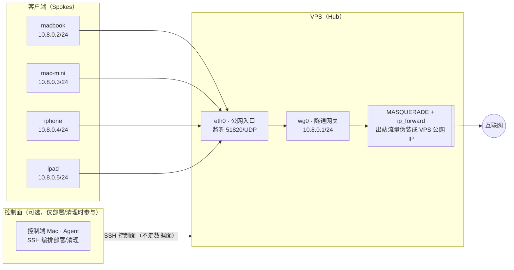

# 架构说明

## 拓扑：中心-辐条（Hub-and-Spoke）

> 控制端（Agent）属**控制面**，只在部署/清理时通过 SSH 参与编排，不承载任何业务数据流；数据面（设备 ↔ VPS ↔ 互联网）走加密 UDP 隧道。

- **中心节点（Hub）**：VPS，公网可达，监听一个 UDP 端口（默认 51820）。
- **辐条（Spoke）**：各客户端设备，主动向 Hub 建立隧道；全部流量经 Hub 转发出去（网关模式）。

## 数据流（全隧道网关模式）

1. 客户端把匹配 `AllowedIPs = 0.0.0.0/0` 的所有流量送进 `wg0`；
2. 数据在客户端加密，作为外层 UDP 包发到 `ENDPOINT:WG_PORT`；
3. VPS 内核解密，按目的地址路由到 `eth0`，并做 SNAT（`MASQUERADE`）把源地址换成 VPS 公网 IP；
4. 回程包经 NAT 还原后，按 `wg0` 的 cryptokey routing 送回对应 peer。

因此 VPS 需要：`net.ipv4.ip_forward=1` + `iptables MASQUERADE` + 防火墙放行转发。

## `AllowedIPs` 的双重作用（最容易踩坑）

- **出站**：决定“哪些目标地址的流量进隧道”；
- **入站 ACL**：决定“这个 peer 允许声称自己来自哪些源 IP”。

所以服务端每个 peer 的 `AllowedIPs` 必须是**该设备独有的隧道 IP**（如 `10.8.0.2/32`）。**任何两台设备都不能共用同一把私钥或同一个 IP**，否则会被当作同一个 peer，互相踢会话（见 troubleshooting）。

## 为什么默认只做 IPv4

很多 VPS 没有公网 IPv6 出口。若客户端写 `AllowedIPs = 0.0.0.0/0, ::/0` 而服务端无法转发 IPv6，IPv6 流量会全部黑洞，设备（尤其 macOS/iOS 会偏好 IPv6）会频繁超时回退，表现为“卡、慢、断”。

- 无 IPv6 出口：客户端只用 `0.0.0.0/0`；
- 有 IPv6 出口：才在 `config.env` 填 `WG_NETV6`/`SERVER_V6`，并在添加设备时用 `--ipv6`。

## MTU 与 NAT 保活

- 隧道默认 MTU 1420（1500 - 60 头）。跨封装 / 高延迟 / 易丢包链路可降到 1280；
- `PersistentKeepalive = 25`：位于 NAT/运营商大内网后的客户端每 25 秒发一个心跳，防止 NAT 映射过期导致“挂着就断”。
